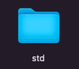
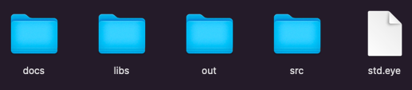

The Iris environment consist of the Iris programming language and various domain specific languages, which have as objective facilitate certain tasks, such as Cornea language, in charge of managing the project configuration, or the Pupil language, similar to Iris but specialised in GPU computing.

It also consists of three console commands: version, create, and compile.

 ## Alphabet

All the characters specified in this alphabet are conforming to the UTF-8 encoding standard.

 ### Alpha characters

 ## Version command

The version command is the option to print the version of the running iris compiler.

 ### Usage

``version``

 ## Create command

The create command is the option to create the project with the specified name after the '-' character.

Its accepted characters are '_', from '0' to '9', from 'A' to 'Z', and from 'a' to 'z'.

 ### Usage

``create-std``

This will create the following project folder:

and inside the project folder, the following project structure:

If any of the items of the project structure couldn't be created, it will print an error.